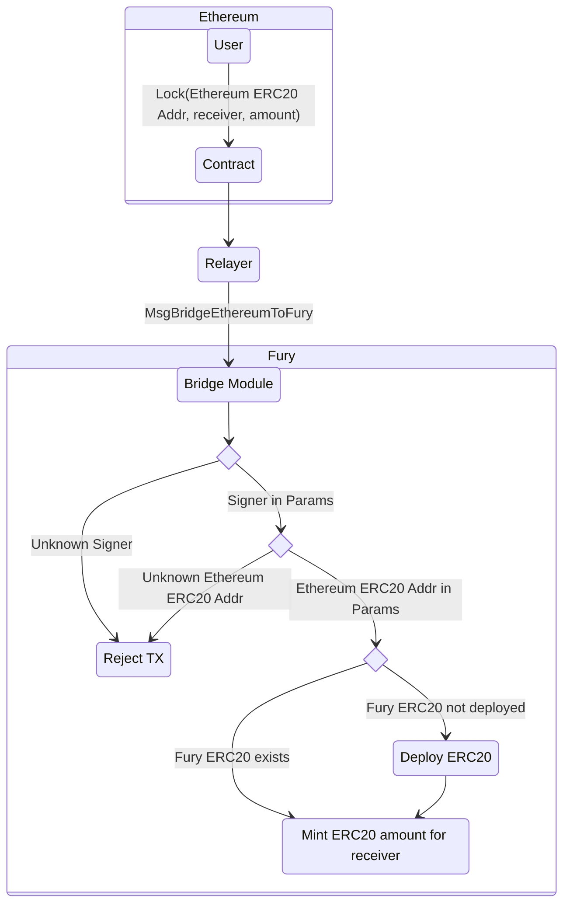
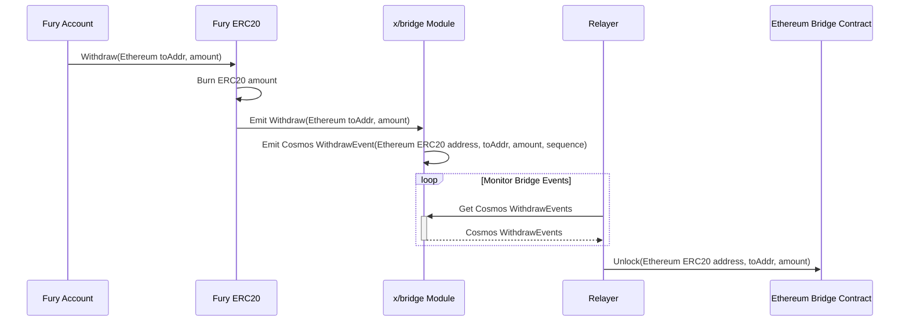

# Concepts

The bridge module deploys ERC20 contracts and mints ERC20 tokens on the Fury EVM
for cross-chain ERC20 token transfers. This module also supports a intra-bridge
to convert between Fury EVM ERC20 tokens and Fury Cosmos coins.

## Requirements

Bridge Contract

* The bridge contract must be deployed on Ethereum.

Signer

* There must be trusted a signer that watches the bridge smart contract on
  Ethereum for locked asset events. This is a single signer for now.

## ERC20

In the following documents, Ethereum ERC20 will refer to an ERC20 token deployed
on the Ethereum network. Fury ERC20 will refer to an ERC20 token deployed on the
Fury EVM.

## Sequence

There are two different incrementing sequences, one on the Bridge contract and
`x/bridge` module. These are unique for each deposit (Ethereum to Fury) and
each withdraw (Fury to Ethereum), but are not unique in that a deposit sequence
value can be the same as a withdraw sequence. This is used by the relayer to
properly order transactions.

## Assumptions

Fury ERC20 contracts are **trusted**, as they are only deployed by the bridge
module account. Fury ERC20 contracts deployed by non-module accounts are not
supported at this moment.

## Ethereum Bridge

### Ethereum ERC20 to Fury Transfers

Before being able to bridge Ethereum ERC20 tokens, they need to be added to the
enabled ERC20 tokens in params.

In order to bridge an approved Ethereum ERC20 tokens to Fury, the following
steps are taken:

1. Account locks ERC20 tokens in the bridge contract on Ethereum. This emits an
   event with the Ethereum ERC20 address, Ethereum sender address, receiver Fury
   address, amount, and sequence.
2. After a reasonable number of confirmations, the relayer will sign and submit
   a `MsgBridgeEthereumToFury` message to the Fury chain.
3. The bridge module will verify the message for the following conditions. If
   any of these are false, the transaction will be rejected.
   * The signer address of the message matches the one set in params.
   * The Ethereum ERC20 token is contained in the enabled list set in params.
4. The target Fury ERC20 address is fetched in the module state. If it doesn't
   exist in state, i.e. the Fury ERC20 contract does not exist, it is deployed.
5. The bridge module mints Fury ERC20 tokens for the destination Fury address.

### Fury ERC20 to Ethereum Transfers

Transferring from Fury to Ethereum follows a similar pattern. Of the following
steps, only step 1 is implemented in the bridge module and the subsequent steps
are done by the relayer.

1. Account calls `Withdraw(withdrawal Ethereum Address, amount)` on a Fury ERC20
   contract. This burns the account tokens and emits a `Withdraw` event
   containing the receiver Ethereum address and corresponding amount.
2. Module `PostTxProcessing` EVM hook scans for `Withdraw` events from enabled
   `ERC20BridgePair`s and emits a [Cosmos SDK Event][cosmos-event] with the
   withdrawal Ethereum address, corresponding ERC20 address to send funds to,
   amount, and unique withdraw sequence.

   **Note:** If the Withdraw event comes from a contract that isn't in bridge
   state (`EnabledERC20Tokens`), then it is ignored. These events may come from
   a contract that isn't deployed by the bridge module. Arbitrary contracts
   cannot maliciously try to get funds withdrawn this way as the withdrawal
   Ethereum ERC20 address is queried from module params, not from contract
   events.
3. When Relayer queries a new Withdraw bridge module event, unlock funds on the
   Ethereum bridge contract.

**Note:** Currently, only ERC20 tokens that originated from Ethereum can be
transferred to Ethereum. This requires bidirectional mint/burn and lock/unlocks
which is currently not supported, ie lock/unlock must exist on the originating
side, mint/burn must exist on the receiving side. Only the Ethereum bridge
contract has lock/unlock and only `x/bridge` has mint/burn.

## ERC20 and Cosmos Coin Conversions

### Fury ERC20 to Fury Cosmos Coin

ERC20 tokens on the Fury EVM can be converted to Fury `sdk.Coin`s and vice
versa.

To convert Fury ERC20 to Fury Cosmos Coin, the following steps are taken. Note
that any method calls on ERC20 will only apply to contracts which are enabled in
params and exist in state.

1. Account calls `ConvertToCoin(toFuryAddr, amount)` on the desired ERC20
   contract. This does two things:
   * Emit a `ConvertToCoin(toFuryAddr, amount)` event.
   * Transfer token amount to the module account address.
2. Similar to Fury ERC20 to Ethereum transfers, a `PostTxProcessing` EVM hook
   will look for corresponding transactions only emitted from enabled
   `ConversionPair`s that contain both a `ConvertToCoin` and `Transfer`
   event.
3. Bridge module mints `sdk.Coin` with the corresponding amount. The denom is
   defined in the `ConversionPair`.
4. Minted coins are sent to the provided `toFuryAddr`.

### Fury Cosmos Coin to Fury ERC20

Similar to how only ERC20 tokens that originate from Ethereum can be bridged
from Fury to Ethereum, converting cosmos coins to Fury ERC20 can only be done
with coins that originated from the Fury EVM. This means assets that are native
Cosmos coins such as SWP, HARD, native FURY, IBC tokens, etc. **cannot** be
converted this way. New token pairs must be added to the [params](https://github.com/Fury-Labs/fury-bridge/blob/main/x/bridge/spec/05_params.md) and added to the module via governance proposal.

Conversions back to Fury ERC20 are as follows.

1. **Fury** account submits `ConvertCoinToERC20` message. This contains the
   sendTo Ethereum address, and coins (containing both denom and amount).
2. Module checks if the account balance is greater than the desired conversion
   amount and checks enabled `ConversionPair`s to see if this is
   permitted for the provided coins.
3. Cosmos coins are transferred to the bridge module account.
4. Module account transfers the equivalent ERC20 token to the provided address.
5. Burn cosmos coins.
6. Ensure account ERC20 token balance increased by the requested amount.

[cosmos-event]: https://docs.cosmos.network/master/core/events.html
